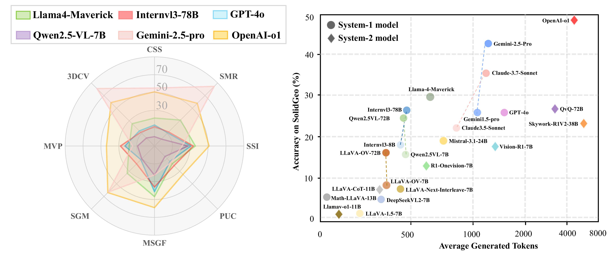
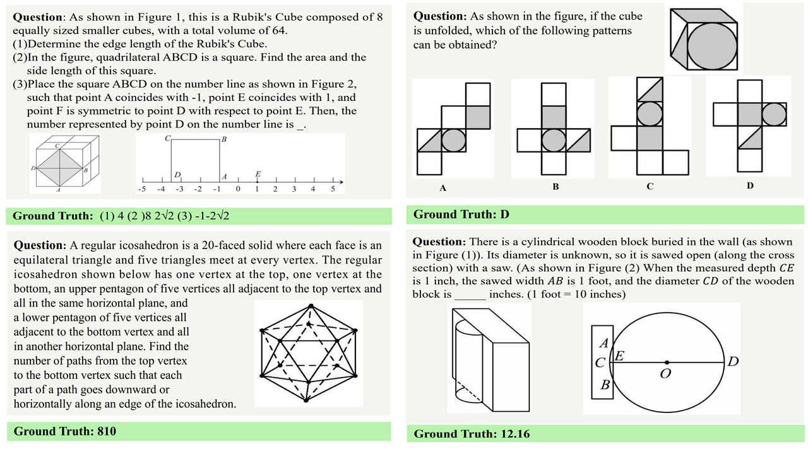

# SolidGeo: Measuring Multimodal Spatial Math Reasoning in Solid Geometry

[[💻 Github](https://github.com/HarryYancy/SolidGeo)]  [[🤗 Huggingface Dataset](https://huggingface.co/datasets/HarryYancy/SolidGeo)] [[📖 Paper(coming soon)]()]


## Dataset Description

**SolidGeo** is the first large-scale benchmark specifically designed to evaluate the performance of MLLMs on mathematical reasoning tasks in **solid geometry**. **SolidGeo** consists of **3,113** real-world K–12 and competition-level problems, each paired with visual context and annotated with **3** difficulty levels and **8** fine-grained solid geometry categories. Our benchmark covers a wide range of 3D reasoning subjects such as projection, unfolding, spatial measurement, and spatial vector, offering a rigorous testbed for assessing solid geometry.Through extensive experiments, we observe that MLLMs encounter substantial challenges in solid geometry math tasks, with a considerable performance gap relative to human capabilities on **SolidGeo** .We hope **SolidGeo** serves as a catalyst for advancing MLLMs toward deeper geometric reasoning and spatial intelligence.



Performance of six MLLMs on SolidGeo benchmark across 8 solid geometry subjects (left), and trade-off between accuracy and average generated token length across 25 MLLMs (right).

## Dataset Examples

Some examples of our datasets.



Click to expand/collapse more examples

<details>
<summary>Measurement of Solid Geometric Forms</summary><p align="center">
     <br>
</p></details>

<details>
<summary>Solid Shape Identification</summary><p align="center">
     <br>
</p></details>

<details>
<summary>Spatial Metric Relations</summary><p align="center">
     <br>
</p></details>

<details>
<summary>Multi-view Projection</summary><p align="center">
     <br>
</p></details>

<details>
<summary>Planar Unfolding and Configuration</summary><p align="center">
     <br>
</p></details>

<details>
<summary>Composite Solid Structures</summary><p align="center">
     <br>
</p></details>

<details>
<summary>3D Coordinate and Vector Reasoning</summary><p align="center">
     <br>
</p></details>

<details>
<summary>Solid Geometry Modeling</summary><p align="center">
     <br>
</p></details>

## Data Format

```json
{
  "question": [string] The question text.
  "choices": [list of string] Choice options for some questions.
  "image": [list of string] A list of image file paths used in the question text.
  "answer": [string] The final answer to the question, provided in LaTeX format for consistent mathematical formatting.
  "solution": [list of string] A Optional list of solution steps.
  "answer_type": [string] The format of the answer:"single_step", "multi_step", "choice"
  "problem_type": [list of strings] A classification of the type of math problem :"Measurement of Solid Geometric Forms","Solid Shape Identification","Spatial Metric Relations","Multi-view Projection","Planar Unfolding and Configuration","Composite Solid Structures","3D Coordinate and Vector Reasoning","Solid Geometry Modeling".
  "complexity_level": [string] An indicator of the difficulty level:"Level 1","Level 2","Level 3"
  "source": [string] The origin of the question.
  "qa_id": [integer] A unique identifier for the question-answer pair.
}

```


##  Citation

If you find this work useful, welcome to star us.

```latex
coming soon
```

